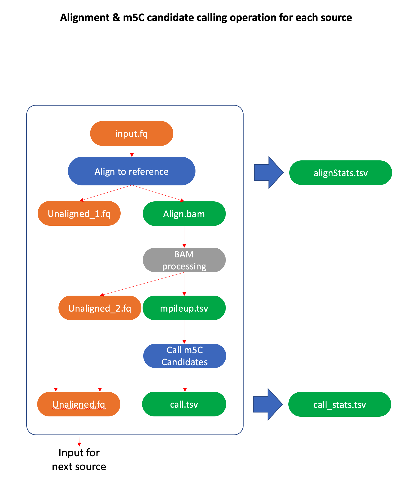
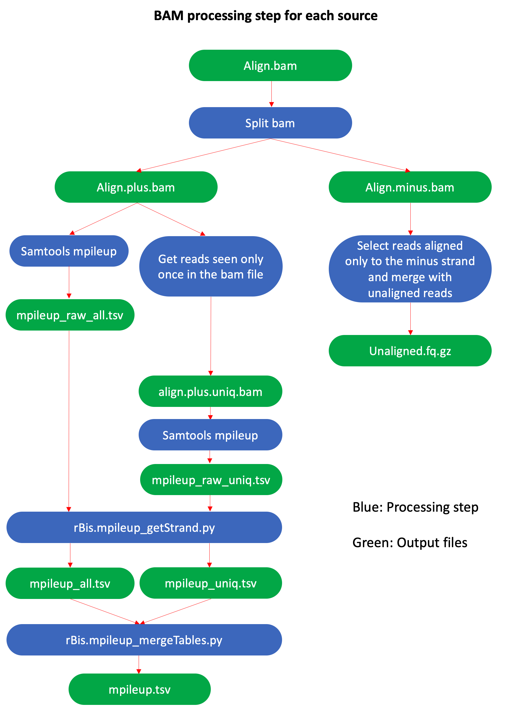

# BisKit_CCHMC

*BisKit* is a snakemake pipeline that allows the user to analyze bisulfite sequencing data.
*BisKit* is currently for use only on the CCHMC HPC.
*BisKit* aligns reads sequentially to multiple RNA sources and outputs detailed alignment, read, and call statistics for each sample as well as pairwise comparison results between the input samples. The results are also summarized in the form of a MultiQC report.

Developers

- Christopher Ahn (CCHMC)
- Hee Woong Lim (CCHMC)
  
<br/>
<br/>

## Pipeline

<p align="center">

</p>
<br/>
<br/>
<br/>
<p align="center">

</p>
<br/>

Alignment is performed using HISAT-3N (http://daehwankimlab.github.io/hisat2/hisat-3n/), and methylation calling is performed using mpileup (http://www.htslib.org/doc/samtools-mpileup.html). After alignment, the resulting bam file is processed to only contain forward-aligned reads that have been aligned exactly once to the forward strand. Reads aligned only to the minus strand are obtained and merged to the unaligned reads resulting from alignment. These unaligned reads are then used for alignment to the next source.

## Sources
BisKit aligns the reads to multiple sources in the following order:

|Source|
|------|
|1. rRNA|
|2. tRNA|
|3. miRNA|
|4. piRNA|
|5. genome|
|6. circRNA|

<br/>

## 1. Setting up the pipeline

### 1.1. Initial setup
*The initial setup should be performed only once.*

Move to your home directory.
```bash
cd ~
```

Clone BisKit_CCHMC to your home directory. You can clone the repo to any location, but for the purposes of this README it will be cloned to your home directory. This will create a folder called BisKit_CCHMC with the files necessary to run BisKit on the CCHMC HPC. Change permissions to the newly downloaded files in case you might not have permission to access them.
```bash
git clone https://github.com/hwlim/BisKit_CCHMC.git
chmod -R 755 ~/BisKit_CCHMC
```

Set PATH to the BisKit directory in **.bash_profile** to have access to it in any directory for ease of use in the future, and define a temporary directory as well for use by BisKit during analysis. For this tutorial (working on the cluster at CCHMC), TMPDIR will be set as the user's scratch directory on the cluster.
```bash
echo 'export BISKIT_PATH=~/BisKit_CCHMC' >>~/.bash_profile
echo 'export PATH=$PATH:${BISKIT_PATH}/Scripts' >>~/.bash_profile
# if not declared
echo 'export TMPDIR=/scratch/$(whoami)' >>~/.bash_profile
source ~/.bash_profile
```

<br/>

### 1.2. Required Files
#### 1.2.1. Reference Directory
A reference directory is required to run BisKit. The directory should look like the following, where each source has its own folder containing fasta files and HISAT-3N index files (the example below is for mm10):
```bash
mm10
├── circRNA
│   ├── circRNA.fa
│   ├── circRNA.fa.fai
│   └── index_HISAT2-3N
├── Genome
│   ├── chrom.size
│   ├── genome.gtf
│   ├── genome.fa
│   ├── genome.fa.fai
│   └── index_HISAT2-3N
├── lookupTable.tsv
├── miRNA
│   ├── index_HISAT2-3N
│   ├── miRNA.fa
│   ├── miRNA.fa.fai
│   └── miRNA.gtf
├── piRNA
│   ├── index_HISAT2-3N
│   ├── piRNA.fa
│   └── piRNA.fa.fai
├── rRNA
│   ├── index_HISAT2-3N
│   ├── rRNA.fa
│   └── rRNA.fa.fai
└── tRNA
    ├── index_HISAT2-3N
    ├── tRNA.fa
    └── tRNA.fa.fai
```

Each source directory should contain the files above, with the exact file names.
The **lookupTable.tsv** file contains the genomic coordinates for the non-genome sources.
If you are part of CCHMC, contact the authors for access to these files as they are available on the cluster.

If you would like to create the HISAT-3N index files yourself, check out the following link on how to create them: (http://daehwankimlab.github.io/hisat2/hisat-3n/)
You should include splice site information if available.

Make sure the index folder names are "index_HISAT2-3N".

<br/>

### 1.3. Initialize the analysis folder

Create a workspace folder for analysis in your desired location on the HPC. For the purposes of this README, the name of the analysis folder will be "BisKit_Analysis" and created in the home directory. Move into the newly created folder by entering the following commands:
```bash
mkdir ~/BisKit_Analysis
cd ~/BisKit_Analysis
```

Create a new directory within the analysis folder called **"0.Fastq"**. 
```bash
mkdir 0.Fastq
```
Put all fastq data files (only single-end sequencing data are supported at this time; if you have data from paired-end sequencing, you will only be using one of the two paired fastq files.) to be used for analysis within this folder. The name of this folder should not be changed.


Run the following command in your analysis folder (same directory as your 0.Fastq folder).
```bash
rBis.init.sh
```

This should create the following two files, and your analysis directory will look like the following:
```bash
BisKit_Analysis
├── 0.Fastq
├── config.bis.yml
└── sample.tsv
```

<br/>

#### 1.3.1. sample.tsv
**sample.tsv** is a tab-separated sample information file with the following 4 columns:
- **Id**: Unique sample ID. This is used for trimming. 
- **Name**: Sample name. This becomes the output folder name for each sample.
- **Group**: Group name. Replicates of the same sample should be named under the same group.
- **Fq1**: Name of the fastq file for each sample. As of now, paired-end is not supported. Try typing out the absolute path of the fastq files if snakemake returns an error while finding the fastq files.

Note:
- No white space is allowed in the file except for the column separator "tab".
- **Id** and **Name** columns must contain unique values that don't overlap with other samples. **Id** and **Name** can be identical for each sample.

Example:

|Id|Name|Group|Fq1|
|--|----|-----|---|
|Sample1_1|Sample1_1|Sample1|Sample1_1.fq.gz
|Sample1_2|Sample1_2|Sample1|Sample1_2.fq.gz
|Sample2_1|Sample2_1|Sample2|Sample2_1.fq.gz
|Sample2_2|Sample2_2|Sample2|Sample2_2.fq.gz
|Sample3_1|Sample3_1|Sample3|Sample3_1.fq.gz
|Sample3_2|Sample3_2|Sample3|Sample3_2.fq.gz

Note that the **Id** and **Name** are the same for each sample, and the **Group** is the same for each replicate.

<br/>

#### 1.3.2. config.bis.yml
**config.bis.yml** is a config file for pairwise comparisons.<br>
- Under **diff_pair_list**, enter your comparison name. Below the comparison name, list the samples to be compared in each line. The list of samples should be in order such that replicates come after each other. Check the file for an example of how the samples should be entered. <br>
- Under **params** are the parameters used for the analysis. Each parameter is explained in the table below:

|Parameter|Description|Default Value|
|---------|-----------|-------------|
|**refDir**|Path to the reference directory that contains reference files and HISAT2 index files (covered in section 1.2.1 of this README).|"/Genomes/mm10"|
|**adapter**|adapter used for trimming. Set as "NULL" if you don't want to perform trimming. Check the config file for detailed adapter options.|["AGATCGGAAGAGC", "TGGAATTCTCGGGTGCCAAGG"]|
|**opt_cutadapt**|Additional options used for cutadapt. Follow the cutadapt software flag syntax; leave empty quotes if N/A.|"--minimum-length 18 -q 20"|
|**softClipping**|Soft-clipping setting for alignment|True|
|**Allow_genome_spliced_alignment**|Allow spliced alignment during genome alignment|True|
|**Allow_RNA_spliced_alignment**|Allow spliced alignment during RNA alignment|False|
|**doDedup**|Perform deduplication|False|
|**chrRegexTarget**|Regular expressions for target chromosome names.|"^chr[0-9XY]+$"|
|**coverage_threshold**|threshold for minimum coverage for a position to be considered a potential candidate|10|
|**methylationRate_threshold**|threshold for minimum 'methylation rate' for a position to be considered a potential candidate|0.1|
|**differential_threshold**|threshold for minimum difference between two samples at a position to be considered a significant candidate|0.05|
|**statistical_significance_call**|type of statistical significant to be used for the methylation call step|p-value|
|**statistical_threshold_call**|value of statistical threshold for the methylation call step|0.05|
|**minimum_replicates**|minimum replicates a C has to be observed in to be considered a candidate|2|
|**minimum_C_count**|minimum C count needed for a position to be considered a candidate|3|
|**statistical_significance_diff**|type of statistical significance to be used for differential analysis|p-value|
|**statistical_threshold_diff**|value of statistical threshold for the methylation call step|0.05|

<br/>

## 2. Running BisKit

### 2.1. Dry-run
Perform a dry-run in the BisKit_Analysis directory to check if everything is correctly defined.
```bash
rBis.dry_run.sh
```
Correct any errors that occur; errors can be caused by incorrect parameters, folders, and/or missing inputs.

### 2.2. Run BisKit
Run BisKit by submitting a Snakemake job in your analysis directory by running the command below. Make sure any previously loaded modules are purged to make sure no conflicts occur between environments. This can happen especially if a different python version is loaded while the pipeline is running.
```bash
module purge
rBis.run.sh
```

### 2.3. Job monitoring
After running BisKit, check if the jobs are automatically created and submitted by Snakemake using the following command:
```bash
bjobs
```
There will be only one job during the first few seconds or even up to a couple minuts depending on the network status of the cluster. The first jobs that appears in the jobs list is the master job that automatically creates and submits each task.<br>
Child jobs will eventually appear and run as their dependencies are satisfied.<br>

<br/>

## 3. Output
(tl;dr available in section 3.4)

### 3.0. Job log
Once the job is complete or ends prematurely due to an error, two log files will be created in your work directory.<br>
These file names are specified in rBis.submit_snake.sh as the following:
- submit.err
- submit.out

<br/>

Try:
```bash
tail submit.err
```
If you see something along the lines of **"(100%) done"**, the run is complete.<br>
If you do not see 100%, it means there was an error in one of the jobs.<br>
Investigate the **submit.err** file to check which job exited due to an error. It will show the name of the rule and the sample.<br>
Check the log of individual jobs under the **logs** directory in your work directory and open the corresponding **.err** file to check what error has been raised.<br>

Note: There may be other errors that don't show specific details in the **err** file. In that case, check the file with the **.out** extension. It may be related to insufficient memory.

<br/>

### 3.1. Output Structure
```bash
BisKit_Analysis
├── 0.Fastq
├── 1.Sample
├── 1.Sample_Plots
├── 2.Diff
├── 3.combined_Diff
├── 4.multiQC
├── config.bis.yml
├── diag.pdf
├── logs
├── multiqc_report.html
├── sample.tsv
├── submit.err
└── submit.out
```

<br/>

### 3.2 MultiQC Report
Once BisKit is complete, there will be a file named **multiqc_report.html** in the work directory. This file contains interactive plots that display alignment, call, and differential analysis statistics. 

Since these are interactive plots, you can hover over the plot to see the detailed numbers.

Note that some plots will not be generated if there is no data for that particular section; instead, there will be a **Error - was not able to plot data.** text. Detailed explanations of the contents of the MultiQC report are shown below:

#### 3.2.1. Alignment Statistics
|Section|Description|
|-------|-----------|
|Read Stratification (All)|Number of reads aligned to each source per sample; includes reads that are unaligned|
|Read Stratification (Aligned)|Number of reads aligned to each source per sample|
|{Source1} Alignment|{Source1} alignment statistics per sample; contains info on uniquely aligned, multi-aligned, and unaligned reads|
|{Source2} Alignment|{Source2} alignment statistics per sample; contains info on uniquely aligned, multi-aligned, and unaligned reads|
|...|...|

#### 3.2.2. M-Bias Plots
|Section|Description|
|-------|-----------|
|{Source1} M-Bias Plot|M-Bias plot for {Source1}|
|{Source2} M-Bias Plot|M-Bias plot for {Source2}|
|...|...|

#### 3.2.3. Call Statistics
|Section|Description|
|-------|-----------|
|All Call Stats (Plot)|Call statistics for all sources per sample; shows the number of significant and non-significant candidates in the form of a plot|
|All Call Stats (Table)|Call statistics for all sources per sample; shows the number of significant and non-significant candidates in the form of a table|
|{Source1} Call Stats (Plot)|Call statistics for candidates in reads aligned to {Source1} shown as a plot|
|{Source1}  Call Stats (Table)|Call statistics for candidates in reads aligned to {Source1} shown as a table|
|{Source2} Call Stats (Plot)|Call statistics for candidates in reads aligned to {Source2} shown as a plot|
|{Source2} Call Stats (Table)|Call statistics for candidates in reads aligned to {Source2} shown as a table|
|...|...|

#### 3.2.4. Differential Analysis
|Section|Description|
|-------|-----------|
|Differential Analysis|Differential analysis statistics for all sources per sample; shows up/down regulated candidates, as well as candidates that are unique to one sample; (uniq1 = unique to sample on the left)|
|{Source1} Categorization (All)|Differential analysis statistics for candidates in reads aligned to {Source1}; includes candidates unique to each sample|
|{Source1} Categorization (UP vs DOWN)|Differential analysis statistics for candidates in reads aligned to {Source1}; shows up vs down regulated candidates only|
|{Source2} Categorization (All)|Differential analysis statistics for candidates in reads aligned to {Source2}; includes candidates unique to each sample|
|{Source2} Categorization (UP vs DOWN)|Differential analysis statistics for candidates in reads aligned to {Source2}; shows up vs down regulated candidates only|
|...|...|

#### 3.2.5. Distribution Plots
Shows the distribution of up/down regulated candidates per sample comparison.

#### 3.2.6. Volcano Plots
Shows the information on the difference between methylation rate and p-values of sample comparisons.

<br/>

### 3.3. Detailed Output Files
#### 3.3.1. 1.Sample Directory
The **1.Sample** directory contains output files pertaining to each sample.
```bash
1.Sample/Sample1/
├── 1.rRNA
│   ├── Align
│   │   ├── align.bam
│   │   ├── align.bam.bai
│   │   ├── align.log
│   │   ├── align.minus.bam
│   │   ├── align.minus.bam.bai
│   │   ├── align.plus.bam
│   │   ├── align.plus.bam.bai
│   │   ├── align.plus.uniq.bam
│   │   ├── align.plus.uniq.bam.bai
│   │   ├── alignStats.tsv
│   │   ├── m-bias_mostCommonReadLength_forward.png
│   │   ├── m-bias_mostCommonReadLengthOfGenomeAlignment_forward.png
│   │   ├── m-bias_mostCommonReadLengthOfGenomeAlignment_reverse.png
│   │   ├── m-bias_mostCommonReadLength_reverse.png
│   │   ├── unaligned.fq.gz
│   │   └── unaligned_pre.fq.gz
│   ├── call_cov10
│   │   ├── call_stats_simplified.tsv
│   │   ├── call_stats.tsv
│   │   ├── call.tsv
│   │   ├── log2_cov.png
│   │   ├── log2_cov_pVal.png
│   │   ├── methRate.png
│   │   └── methRate_pVal.png
│   ├── mpileup_out_raw_all.tsv
│   ├── mpileup_out_raw_uniq.tsv
│   └── readStats.tsv
├── 2.tRNA
│   ├── Align
│   ├── call_cov10
│   ├── featureCount_all.txt
│   ├── featureCount_uniq.txt
│   ├── mpileup_out_raw_all.tsv
│   ├── mpileup_out_raw_uniq.tsv
│   └── readStats.tsv
├── 3.miRNA
│   ├── Align
│   ├── call_cov10
│   ├── featureCount_all.log
│   ├── featureCount_all.txt
│   ├── featureCount_all.txt.summary
│   ├── featureCount_uniq.log
│   ├── featureCount_uniq.txt
│   ├── featureCount_uniq.txt.summary
│   ├── mpileup_out_raw_all.tsv
│   ├── mpileup_out_raw_uniq.tsv
│   └── readStats.tsv
├── 4.piRNA
│   ├── Align
│   ├── call_cov10
│   ├── featureCount_all.txt
│   ├── featureCount_uniq.txt
│   ├── mpileup_out_raw_all.tsv
│   ├── mpileup_out_raw_uniq.tsv
│   └── readStats.tsv
├── 5.genome
│   ├── Align
│   ├── call_cov10
│   ├── featureCount_all.log
│   ├── featureCount_all.txt
│   ├── featureCount_all.txt.summary
│   ├── featureCount_uniq.log
│   ├── featureCount_uniq.txt
│   ├── featureCount_uniq.txt.summary
│   ├── mpileup_out_raw_all.tsv
│   ├── mpileup_out_raw_uniq.tsv
│   ├── mpileup_uniq.tsv
│   ├── readLenGenome.txt
│   └── readStats.txt
├── 6.circRNA
│   ├── Align
│   ├── call_cov10
│   ├── featureCount_all.txt
│   ├── featureCount_uniq.txt
│   ├── mpileup_out_raw_all.tsv
│   ├── mpileup_out_raw_uniq.tsv
│   ├── mpileup_uniq.tsv
│   └── readStats.tsv
├── cov10
│   ├── mergedAlignStats.tsv
│   ├── mergedCallStatsNoHeader.tsv
│   ├── mergedCallStats.tsv
│   ├── mergedCandidates.tsv
│   ├── Plots
│   │   ├── Candidate_Stratification_(All).pdf
│   │   ├── Candidate_Stratification_(All).png
│   │   ├── Candidate_Stratification_(pVal)_(Annotated).pdf
│   │   ├── Candidate_Stratification_(pVal)_(Annotated).png
│   │   ├── Candidate_Stratification_(pVal).pdf
│   │   ├── Candidate_Stratification_(pVal).png
│   │   ├── Read_Stratification_Without_Unaligned.pdf
│   │   ├── Read_Stratification_Without_Unaligned.png
│   │   ├── Read_Stratification_With_Unaligned.pdf
│   │   ├── Read_Stratification_With_Unaligned.png
│   │   ├── Significant_Candidate_Count.pdf
│   │   ├── Significant_Candidate_Count.png
│   │   ├── Significant_Candidate_Percentage.pdf
│   │   └── Significant_Candidate_Percentage.png
│   ├── minus.bw
│   └── plus.bw
└── featureCounts.tsv
```

Each source is numbered in order of alignment, and each numbered directory contains the following:
- **Align** directory contains alignment bam files and static m-bias plots.
> - align.bam contains information of all aligned reads.
> - align.minus.bam contains information of reads aligned to the minus strand
> - align.plus.bam contains information of reads aligned to the plus strand
> - align.plus.uniq.bam contains information of reads uniquely aligned to the plus strand
> - alignStats.tsv contains organized alignment statistics
> - m-bias_mostCommonReadLength.png shows m-bias using the most common read length of all reads.
> - m-bias_mostCommonReadLengthOfGenomeAlignment.png shows m-bias using the most common read length of genome alignment.
> - unaligned.fq.gz contains the reads that have not aligned to the current source.
> - unaligned_pre.fq.gz is a raw fastq file of unaligned reads, not containing reads filtered out from the bam processing step.

- **call_cov10** directory contains information on from the m5C call step.
> - call_stats_simplified.tsv contains call statistics of only those that have at least 10 coverage.
> - call_stats.tsv contains call statistics of all candidates.
> - call.tsv contains m5C call results.

|Col #|Field|Description|
|-----|-----|-----------|
|1|#SeqID|Chromosome number or reference name|
|2|refPos|1-based nucleotide position on the reference|
|3|refStrand|Strand of the reference|
|4|refBase|Nucleotide at the current position|
|5|cov|Read coverage at the current position|
|6|C_count|Number of unconverted C at the current position|
|7|methRate|Methylation Rate at the current position; N<sub>[C]</sub>/N<sub>[CT]</sub>|
|8|uniqCov|Number of unique reads covering the current position|
|9|C_count_uniq|Number of unconverted C from unique reads at the current position|
|10|methRate_uniq|Unique methylation Rate at the current position; N<sub>[C]</sub>/N<sub>[CT]</sub>|
|11|95_CI_lower|Lower confidence interval|
|12|95_CI_upper|Upper confidence interval|
|13|p-value_mState|p-value for methylation state|
|14|FDR_mState|FDR for methylation state|
|15|scores|Confidence interval scores; the higher the better|
|16|seqContext|Sequence context around the current nucleotide position; ±3|
|17|genomicCoords|Genomic Coordinates for the current position; will be empty for rRNA|
|18|gene_type|Gene type|
|19|gene|Gene name; will be empty for rRNA|

> - log2_cov.png shows the distribution of log2(coverage)
> - log2_cov_pVal.png shows the distribution of log2(coverage) after applying the p-value threshold to the candidates
> - methRate.png shows the distribution of the methylation rate
> - methRate_pVal.png shows the distribution of the methylation rate after applying the p-value threshold to the candidates
> - mpileup_out_raw.tsv files contain the raw output files from mpileup

- **featureCount_all.tsv** file contains the feature counts for each sample based on the input gtf file for each source (excluding rRNA).
- **featureCount_uniq.tsv** file contains the unique feature counts for each sample based on the input gtf file for each source (excluding rRNA).
- **readStats.tsv** file contains the read statistics including alignment to plus or minus strand, unique alignment or multi alignment etc.
- **cov10** directory contains statistics merged by sample.
> - mergedAlignStats.tsv file contains the merged alignment statistics for all sources of the current sample.
> - mergedCallStatsNoHeader.tsv file contains the merged call statistics for all sources of the current sample without the column headers (for multiqc purposes).
> - mergedCallStats.tsv file contains the merged call statistics for all sources of the current sample.
> - mergedCandidates.tsv file contains the m5C candidates merged for all sources of the current sample.

|Col #|Field|Description|
|-----|-----|-----------|
|1|#SeqID|Chromosome number or reference name|
|2|refPos|1-based nucleotide position on the reference|
|3|refStrand|Strand of the reference|
|4|refBase|Nucleotide at the current position|
|5|cov|Read coverage at the current position|
|6|uniqCov|Number of unique reads covering the current position|
|7|C_count|Number of unconverted C at the current position|
|8|methRate|Methylation Rate at the current position; N<sub>[C]</sub>/N<sub>[CT]</sub>|
|9|95_CI_lower|Lower confidence interval|
|10|95_CI_upper|Upper confidence interval|
|11|p-value_mState|p-value for methylation state|
|12|FDR_mState|FDR for methylation state|
|13|scores|Confidence interval scores; the higher the better|
|14|seqContext|Sequence context around the current nucleotide position; &plusmn;3|
|15|genomicCoords|Genomic Coordinates for the current position; will be empty for rRNA|
|16|gene_type|Gene type|
|17|gene|Gene name; will be empty for rRNA|
|18|Source|Source or species|

> - Plots directory contains plots for read stratification and candidiate stratification.
> - minus.bw file is the bigwig file for the reads aligned to the minus strand to be viewed on a genome browser such as IGV.
> - plus.bw file is the bigwig file for the reads aligned to the plus strand to be viewed on a genome browser such as IGV.

- **featureCount_all.tsv** file contains feature counts from all sources for each sample (excluding rRNA).


#### 3.3.2. 1.Sample_Plots Directory
The **1.Sample_Plots** directory contains plots comparing all samples.
```bash
1.Sample_Plots/
├── Candidate_Stratification_Count_(All).pdf
├── Candidate_Stratification_Count_(All).png
├── Candidate_Stratification_Count_(Annotated).pdf
├── Candidate_Stratification_Count_(Annotated).png
├── Candidate_Stratification_Count_(Significant).pdf
├── Candidate_Stratification_Count_(Significant).png
├── Candidate_Stratification_Percentage_(All).pdf
├── Candidate_Stratification_Percentage_(All).png
├── Candidate_Stratification_Percentage_(Annotated).pdf
├── Candidate_Stratification_Percentage_(Annotated).png
├── Candidate_Stratification_Percentage_(Significant).pdf
├── Candidate_Stratification_Percentage_(Significant).png
├── Read_Stratification_Count.pdf
├── Read_Stratification_Count.png
├── Read_Stratification_Percentage.pdf
├── Read_Stratification_Percentage.png
├── Significant_Candidate_Count.pdf
├── Significant_Candidate_Count.png
├── Significant_Candidate_Percentage.pdf
└── Significant_Candidate_Percentage.png
```

- Candidate_Stratification_{type}_(All).{ext} plot shows all candidate counts/percentages stratified by source for each sample.
- Candidate_Stratification_{type}_(Annotation).{ext} plot shows annotated candidate counts/percentages stratified by source for each sample.
- Candidate_Stratification_{type}_(Significant).{ext} plot shows significant candidate counts/percentages stratified by source for each sample.
- Read_Stratification_{type}.{ext} plot shows read stratification counts/percentages by source for each sample.
- Significant_Candidate_{type}.{ext} plot shows the counts/percentages of significant and non-significant candiates by sample.

This directory contains comparison plots for candidate stratification for annotation and non-annotation regions, read stratification, and significant candidate counts.
"Significant" is based on the parameters defined in the 'config.bis.yml' file.

#### 3.3.3. 2.Diff Directory
```bash
2.Diff/
├── Sample1_vs_Sample2
│   ├── Cov10_pVal0.05_Diff0.05
│   │   ├── categorized_pairwise_comparison.tsv
│   │   ├── Plots
│   │   │   ├── Categorization_By_Source_Count_(All).pdf
│   │   │   ├── Categorization_By_Source_Count_(All).png
│   │   │   ├── Categorization_By_Source_Count_(Single).pdf
│   │   │   ├── Categorization_By_Source_Count_(Single).png
│   │   │   ├── Categorization_By_Source_Count_(UNIQ1v2).pdf
│   │   │   ├── Categorization_By_Source_Count_(UNIQ1v2).png
│   │   │   ├── Categorization_By_Source_Count_(UPvDOWN).pdf
│   │   │   ├── Categorization_By_Source_Count_(UPvDOWN).png
│   │   │   ├── Categorization_By_Source_Percentage_(All).pdf
│   │   │   ├── Categorization_By_Source_Percentage_(All).png
│   │   │   ├── Categorization_By_Source_Percentage_(Single).pdf
│   │   │   ├── Categorization_By_Source_Percentage_(Single).png
│   │   │   ├── Categorization_By_Source_Percentage_(UNIQ1v2).pdf
│   │   │   ├── Categorization_By_Source_Percentage_(UNIQ1v2).png
│   │   │   ├── Categorization_By_Source_Percentage_(UPvDOWN).pdf
│   │   │   ├── Categorization_By_Source_Percentage_(UPvDOWN).png
│   │   │   ├── Categorization_By_Source.tsv
│   │   │   ├── delta_methRate.png
│   │   │   ├── delta_methRate_pVal.png
│   │   │   ├── methRate_log2foldChange.png
│   │   │   ├── methRate_log2foldChange_pVal.png
│   │   │   ├── volcano.pdf
│   │   │   └── volcano.png
│   │   └── stats.tsv
│   └── pairwise_comparison.tsv
├── Sample1_vs_Sample3
│   ├── Cov10_pVal0.05_Diff0.05
│   └── pairwise_comparison.tsv
└── Sample2_vs_Sample3
    ├── Cov10_pVal0.05_Diff0.05
    └── pairwise_comparison.tsv
```
Each comparison will have its own directory. The 'pairwise_comparison.tsv' file is a raw file with the m5C candidates of the two samples merged together.
- **Cov10_pVal0.05_Diff0.05** directory is named after the coverage, p-value, and differential threshold parameters. In this folder are m5C differential analyses results between the two samples and the statistics. Check the 'categorized_pairwise_comparison.tsv' file to see which candidates are up/down regulated in each sample.
- **Plots** directory contains static plots that show the number of m5C candidates categorized by either up/down regulation, unchanged, or unique to either sample. UNIQ1 means unique to sample1, and UNIQ means unique to sample2.


##### 3.3.3.1. Differential Analysis Results by Comparison
The BisKit pipeline outputs differential analysis results m5C for each sample comparison in the following location:
```bash
2.Diff/{comparison}/Cov10_pVal0.05_Diff0.05/categorized_pairwise_comparison.tsv
```
Each row represents a candidate, and each column represents the following (the number of columns may differ due to the number of samples and replicates; n = number of columns):

|Col #|Field|Description|
|-----|-----|-----------|
|1|Comparison|Shows which two samples are being compared, and whether this m5C candidate is up/down regulated, unchanged, or unique to either sample
|2|#SeqID|Chromosome number or reference name|
|3|refPos|1-based nucleotide position on the reference|
|4|refStrand|Strand of the reference|
|5|refBase|Nucleotide at the current position|
|6|seqContext|Sequence context around the current nucleotide position; &plusmn;3|
|7|genomicCoords|Genomic Coordinates for the current position; will be empty for rRNA|
|8|Source|Source or species
|9|gene_type|Gene type|
|10|gene|Gene name; will be empty for rRNA|
|11|cov_sample1|Read coverage at the current position for sample1|
|12|uniqCov_sample1|Number of unique reads covering the current position for sample1|
|13|C_count_sample1|Number of unconverted C at the current position for sample1|
|14|methRate_sample1|Methylation Rate at the current position for sample 1; N<sub>[C]</sub>/N<sub>[CT]</sub>|
|15|95_CI_lower_sample1|Lower confidence interval for sample1|
|16|95_CI_upper_sample1|Upper confidence interval for sample1|
|17|p-value_mState_sample1|p-value for methylation state for sample1|
|18|FDR_mState_sample1|FDR for methylation state for sample1|
|19|scores_sample1|Confidence interval scores for sample1; the higher the better|
|...|...|Relevant information for the next sample|
|n-5|combined_p-value_mState_sampleName1|Combined p-value for sample 1 (only applicable when there are replicates)|
|n-4|combined_p-value_mState_sampleName2|Combined p-value for sample 2 (only applicable when there are replicates)|
|n-3|p-value_mState_sampleName1_vs_sampleName2|p-value of methylation rate comparison between the two samples|
|n-2|FDR_mState_sampleName1_vs_sampleName2|FDR of methylation rate comparison between the two samples (only available when 'statistical_significance_diff' is set to 'FDR')|
|n-1|combined_FDR_mState_sampleName1|Combined FDR for sample 1 (only applicable when there are replicates; only available when 'statistical_significance_diff' is set to 'FDR')|
|n|combined_FDR_mState_sampleName2|Combined FDR for sample 2 (only applicable when there are replicates; only available when 'statistical_significance_diff' is set to 'FDR')|

#### 3.3.4. 3.combined_Diff Directory
```bash
3.combined_Diff/
└── Cov10_pVal0.05_Diff0.05
    ├── all_sample_comparisons.tsv
    ├── all_sample_comparisons.xlsx
    ├── Differential_Analysis_Categorization_Count_(All).pdf
    ├── Differential_Analysis_Categorization_Count_(All).png
    ├── Differential_Analysis_Categorization_Count_(UNIQ1v2).pdf
    ├── Differential_Analysis_Categorization_Count_(UNIQ1v2).png
    ├── Differential_Analysis_Categorization_Count_(UPvDOWN).pdf
    ├── Differential_Analysis_Categorization_Count_(UPvDOWN).png
    ├── Differential_Analysis_Categorization_Percentage_(All).pdf
    ├── Differential_Analysis_Categorization_Percentage_(All).png
    ├── Differential_Analysis_Categorization_Percentage_(UNIQ1v2).pdf
    ├── Differential_Analysis_Categorization_Percentage_(UNIQ1v2).png
    ├── Differential_Analysis_Categorization_Percentage_(UPvDOWN).pdf
    └── Differential_Analysis_Categorization_Percentage_(UPvDOWN).png
```
- **Cov10_pVal0.05_Diff0.05** directory is named after the coverage, p-value, and differential threshold parameters. In this folder are m5C differential analyses results between the all of the sample comparisons. Check the 'all_sample_comparisons.xlsx' file to see which candidates are up/down regulated in each sample.

##### 3.3.4.1. Combined Differential Analysis Results
The BisKit pipeline outputs combined differential analysis results m5C for all sample comparison to one excel file in the following location:
```bash
3.combined_Diff/Cov10_pVal0.05_Diff0.05/all_sample_comparisons.xlsx
```
Each row represents a candidate, and each column represents the following (the number of columns will differ based on the number of comparisons):

|Col #|Field|Description|
|-----|-----|-----------|
|1|Comparison1|Shows which two samples are being compared, and whether this m5C candidate is up/down regulated, unchanged, or unique to either sample
|2|Comparison2|Shows which two samples are being compared, and whether this m5C candidate is up/down regulated, unchanged, or unique to either sample
|...|...|Relevant sample information as shown in section 3.4.2|

#### 3.3.5. 4.multiQC
Contains raw files used by MultiQC to generate the MultiQC report.

<br/>

### 3.4. Output Files tl;dr
- For QC and analysis statistics, check the **multiqc_report.html** file here:
```bash
BisKit_Analysis
├── 0.Fastq
├── 1.Sample
├── 1.Sample_Plots
├── 2.Diff
├── 3.combined_Diff
├── 4.multiQC
├── config.bis.yml
├── diag.pdf
├── logs
├── >>> multiqc_report.html <<<
├── sample.tsv
├── submit.err
└── submit.out
```

<br/>

- For m5C candidate comparison between two samples, check the **categorized_pairwise_comparison.tsv** file here (example directory structure below assumes you have three input samples and are comparing each sample to another):
```bash
BisKit_Analysis
├── 2.Diff
│   ├── Sample1_vs_Sample2
│   │   ├── Cov10_pVal0.05_Diff0.05
│   │   │   ├── >>> categorized_pairwise_comparison.tsv <<<
│   │   │   ├── Plots
│   │   │   └── stats.tsv
│   │   └── pairwise_comparison.tsv
│   ├── Sample1_vs_Sample3
│   │   ├── Cov10_pVal0.05_Diff0.05
│   │   │   ├── >>> categorized_pairwise_comparison.tsv <<<
│   │   │   ├── Plots
│   │   │   └── stats.tsv
│   │   └── pairwise_comparison.tsv
└── └── Sample2_vs_Sample3
        ├── Cov10_pVal0.05_Diff0.05
        │   ├── >>> categorized_pairwise_comparison.tsv <<<
        │   ├── Plots
        │   └── stats.tsv
        └── pairwise_comparison.tsv
```

<br/>

- For all m5C candidate comparisons among all comparisons, check the **all_sample_comparisons.xlsx** file here:
```bash
BisKit_Analysis
└── 3.combined_Diff
    └── Cov10_pVal0.05_Diff0.05
        ├── all_sample_comparisons.tsv
        └── >>> all_sample_comparisons.xlsx <<<

```

## 4. Some points to note
- The max depth parameter for mpileup is 10,000, which means only a maximum of 10,000 reads will be considered per position. Viewing the entire range of coverage takes too much resources, and methylation information can be captured through the methylation rate.
- Paired-end reads are not supported. If you have paired-end sequencing data, use only one of the fq files (e.g. reads_R1.fq) as input.
- mpileup is used in lieu of hisat-3n-table to call m5C candidates since mpileup is faster when running on large datasets.
- If you want to make additional comparisons between samples that you have not compared during the pipeline, add them to the 'diff_pair_list' parameter in the config.bis.yml file and run the pipeline again. Additional comparisons should not take long since alignment and call results for each sample are already available.
